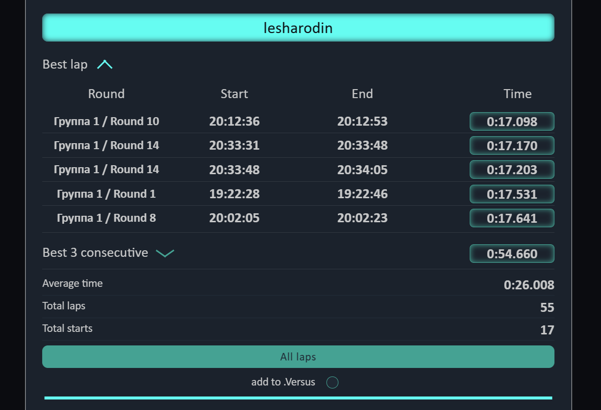
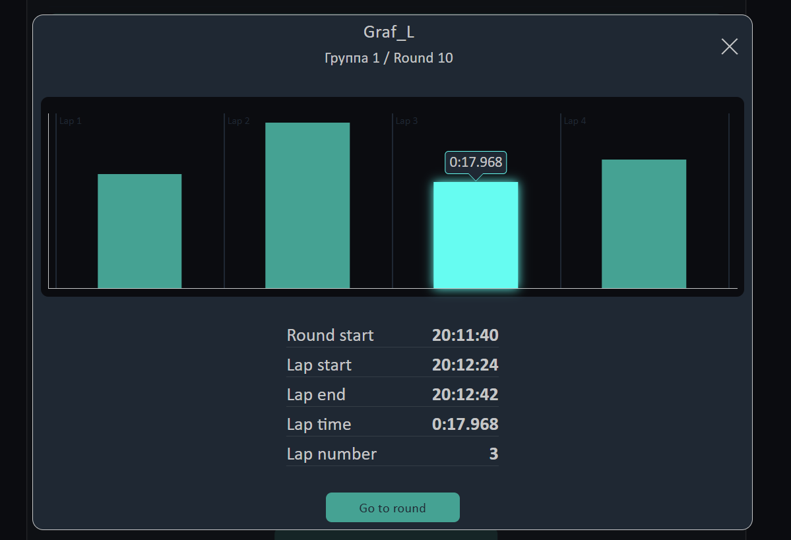
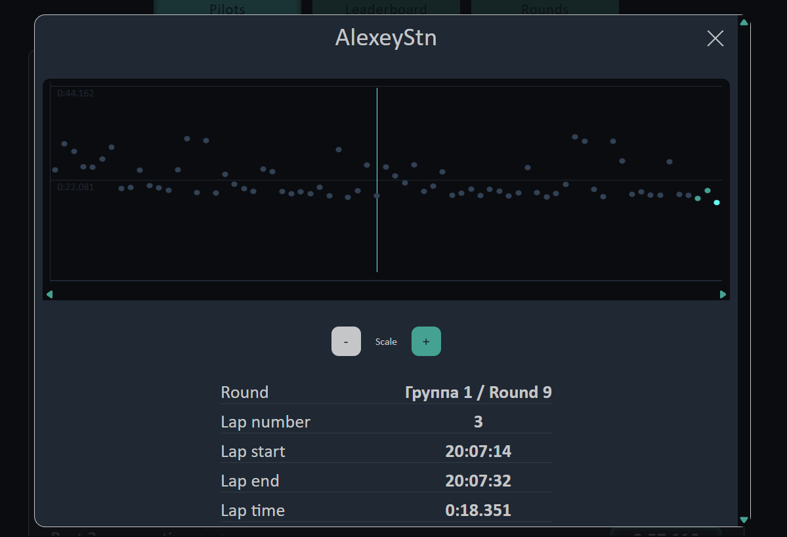

# RotorHazard Results Viewer

A static web application that visualizes lap timing data exported from RotorHazard's Results.json.

## Features
  - View top 5 best single laps and consecutive laps
  - Real-time clock (RTC) timestamps for easy DVR recording lookup
  gti
  - Individual pilot lap time graphs
  - Head-to-head pilot comparison statistics

## Live Demo

Access the live version hosted on GitHub Pages:  
[View Live Demo](https://yourusername.github.io/your-repo-name/)

## Project Background

Developed as part of my web development learning journey, this project focuses on core web technologies:

- HTML5
- CSS3 (with SCSS preprocessing)
- Vanilla JavaScript

Note: As a learning project, the codebase may not follow all enterprise-grade patterns.

## How to Use

1. Export your Results.json from RotorHazard
2. Open the application in your browser
3. Upload the JSON file
4. Explore your race statistics!

## Technical Details

- client-side processing (no server backend)
- Adaptive design (desktop & mobile compatible)
- Lightweight (~354 KB total resources)

## Future Improvements

- Local JSON File Management:
  - Persistent list of previously viewed files
  - Manual refresh option for monitored files
- Telegram Bot Integration:
  - Add/update JSON files remotely via bot commands
- Live Timing Integration:
  - Real-time data connection via RotorHazard plugin (similar to FPVScores)
- Customization:
  - Adjustable number of displayed best laps (currently fixed at 5)

## Contributing

While primarily an educational project, constructive feedback and suggestions are welcome!  
Feel free to contact me with any ideas.

## License

[MIT](LICENSE)